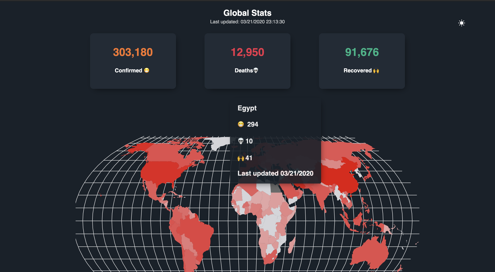

# COVID-VIZ

:rocket: Project that fetches data from this [API](https://covid19.mathdro.id/api) and displays World data and data/country. built using React Hooks + Context API

Stack used:

- Gatsby.js
- Styled-components
- react-simple-maps
- axios
- react-reveal

To run this project:

`git clone https://github.com/m-abdelwahab/covid-viz.git`
`yarn`

create a `.env.development` file in the root folder and add the following

GATSBY_API_ENDPOINT = https://covid19.mathdro.id/api
GATSBY_MAP = https://raw.githubusercontent.com/zcreativelabs/react-simple-maps/master/topojson-maps/world-110m.json
